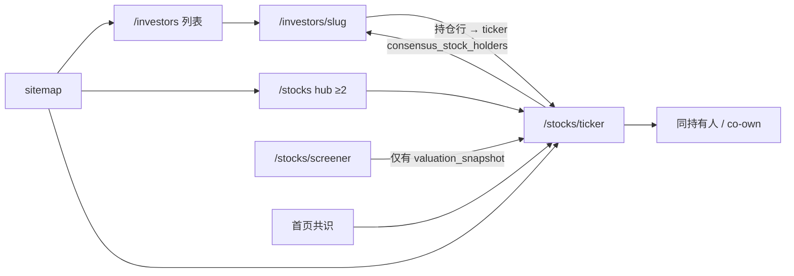

# 13F 扩容验收门禁与页面串联 — 设计

**日期**：2026-07-21  
**分支**：`feat/add-gmo-13f-manager`（可改名为 `feat/13f-expansion-acceptance`）  
**定位**：把「相对 Dataroma / Valuesider 补经理人」做成**可验收的完整交付**——投资人页可开、stocks 全链路（共识 → SEC → 估值）达标、页面互相可点通。  
**前序**：[[2026-06-22-investor-coverage-dataroma-expansion-design]]（策展扩圈）、[[2026-06-08-lean-index-coverage-design]]（≥2 hub/sitemap）、本次会话已落地 GMO + Wave 1（10 户集中组合）13F upsert。

---

## 0. 决策摘要（已定）

| 项 | 选择 |
|---|---|
| 交付形态 | 验收清单 **+** 串联图与缺口收口（两者都要） |
| Stocks 门槛 | **C 档**：≥2 共识票尽量有 fundamentals + 可算则进 `valuation_snapshot`；fill-rate 相对扩前不明显变差 |
| 范围 | 尽量对齐 Valuesider「有人脸」缺口（在品牌准则内） |
| 品牌剔除（Policy A） | 不收：Jensen、Mairs & Power、Third Avenue、Torray、Phil Town / Rule One、Abrams Bison、Independent Franchise、Parnassus |
| 落地路径 | **验收门禁驱动**，分波；每波过门再进下一波 |

---

## 1. 「完整」定义（验收门禁）

一次扩容算完整，必须同时满足：

### 1.1 投资人侧

1. 种子：`web/config/managers.json` 含 CIK / slug / person；CIK 唯一；近期 `13F-HR` reportDate ≥ **2024-06-30**。  
2. 数据：Supabase `managers` + `filings` + `holdings` 有该 slug；`getManagerIndex()` 能列出。  
3. 页面：`/investors` 可见；`/investors/<slug>` 有持仓表与季报切换；sitemap 含该 slug（en + zh）。

### 1.2 Stocks 侧（C 档）

4. 共识：扩后重算 `consensus_holdings` / `consensus_moves`（及个股快照表，见 §2）。  
5. Fundamentals：扩后新增且 `holder_count ≥ 2` 的 ticker，尽量进 `sec_companies` + fundamentals（ADR / 外股 / 非经营性等引擎拒收允许）。  
6. Valuation：能算的 ≥2 票尽量进 `valuation_snapshot`；**valued / consensus 比例相对扩前基线不明显下降**（硬门见 §3.3 M5）。  
7. Lean SEO 不变：`CONSENSUS_MIN_HOLDERS = 2`；独门票不进 sitemap / `/stocks` hub。

### 1.3 串联（必须能点通）

8. 投资人持仓行 → 个股页（有 canonical ticker 时）。  
9. 个股页 → 持有该票的超投列表（含新经理人）。  
10. `/stocks` hub ↔ sitemap 与 ≥2 集合一致。  
11. Screener 仍只展示有快照的票；缺估值显示诚实空态，不假装有数。

### 1.4 明确不算失败

- 单持有人票无估值 / 不进 hub。  
- OpenFIGI 未解析、非经营性证券、未配 `ads_ratio` 的 ADR → 引擎跳过。  
- 宽组合带来的「—」增多，只要 ≥2 的 fill-rate 门禁过关。

---

## 2. 页面串联矩阵

运行时真源是 **Supabase**（`web/src/lib/managers/source.ts`）。本地 `src/data/13f/*.json` 为 ingest 产物且默认 gitignore（`former-names.json` 除外），**不**作为生产页面回退。



| 边 | 数据依赖 | 断了会怎样 |
|---|---|---|
| 列表 → 详情 | `managers` + latest filing | 404 / 列表缺人 |
| 详情 → 个股 | holdings + CUSIP→ticker（OpenFIGI） | 持仓行无链或链到坏 ticker |
| 个股 → 超投 | `consensus_stock_holders`（`computeAndStoreConsensus` 写入） | 新经理人不出现在持有人表 |
| Hub / sitemap → 个股 | `consensus_holdings` 且 `holder_count ≥ 2` | 新共识票不上 hub；独门仍可达但不出 sitemap |
| Screener → 个股 | `valuation_snapshot` | 无快照则不在 screener（诚实空，不算断链） |

### 2.1 每波强制抽查

en 全做；zh 抽 1 个新 slug 即可。

1. `/investors` 能搜到新 person / slug。  
2. `/investors/<new-slug>`：持仓表非空、季报切换、点 Top1 进个股。  
3. 该个股页：持有人表含该新经理人；Related / 同持若有则能点回。  
4. 若该票 `holder_count ≥ 2`：出现在 `/stocks` 与 sitemap；否则确认**不在** sitemap。  
5. 有快照的票：screener 或个股估值卡非「假有数」。  
6. 全局：`managers.json` 人数 = DB 活跃 managers = index 人数。

### 2.2 不抽查 / 不挡合并

首页文案改写、全员中文别名、AI narrative 再生。

---

## 3. 分波名单 + 管线 + 数字门禁

### 3.1 基线（已完成，勿回滚）

- **GMO**（CIK `0001352662`，Jeremy Grantham）+ **Wave 1** 十户集中组合：AltaRock、ADW、Alta Fox、Joho、Greenbrier、7G、Ancient Art、Triple Frond、Meritage、Bares。  
- 种子约 **87**；13F 已 upsert；共识约 **2175** 行（以实施时再采的 DB 数字为准）。  
- 工程附带：`INGEST_ONLY` 支持部分 ingest 并合并写 `index.json` / `former-names.json`（`web/scripts/ingest-13f.ts`）。

实施第一步采扩前基线：`consensus_n`、`ge2_n`、`lonely_n`、`valued_n`、`valued/consensus`。

### 3.2 后续波次

**Wave 2a — 中等宽度（先跑，约 5 户）**  
Hillman、Muhlenkamp、Turtle Creek、Arbiter、Check Capital（Dataroma 缺口优先 + 宽度可控）。

**Wave 2b — 宽组合（2a 门禁绿后再跑，约 5 户）**  
Donald Smith、Eagle Capital、Disciplined Growth、Lountzis、Cullen。

**Policy A 明确不收**  
Jensen、Mairs & Power、Third Avenue、Torray、Phil Town / Rule One、Abrams Bison（无人脸）、Independent Franchise、Parnassus。

每户仍走：SEC 解析 CIK → 13F-HR ≥ 2024-06-30 → 写入 `managers.json`。CIK 以实施时 `validate-13f-filers` / submissions API 为准，本 spec 不锁死 CIK 表（避免过期）。

### 3.3 每波管线（顺序固定）

```
1. 采基线指标（DB）
2. CIK 校验 → 追加 managers.json
3. INGEST_ONLY=<slugs> npm run ingest
   （含 OpenFIGI enrich + consensus：holdings / moves / stock_holders / trend / coownership）
4. npm run sec:ingest:holdings
5. npm run valuation:ingest
6. 采扩后指标 + §2 抽查
7. 门禁绿 → 下一波；红 → 停、缩名单或修 enrich/ADR，不带病进 2b
```

### 3.4 数字门禁（相对本波扩前基线）

| 门 | 条件 |
|---|---|
| M1 种子一致 | `managers.json` 数 = DB 活跃 managers = 抽查 index |
| M2 13F 成功 | 本波 `INGEST_ONLY` 成功比 ≥ 90%（沿用 `MIN_SUCCESS_RATIO`） |
| M3 共识不塌 | `consensus_n` 不下降；`ge2_n` 不下降 |
| M4 独门可控 | `Δlonely / Δconsensus` ≤ 0.6（宁可重叠、少倾倒独门） |
| M5 估值 fill | `valued/consensus` 降幅 ≤ **3pp**，或 `valued_n` 不降 |
| M6 串联 | §2.1 抽查清单全过（每波至少 2 个新 slug + 1 个其 Top 持股） |

M4 / M5 红时：优先丢掉本波最宽、独门最多的 1–2 户，而不是放宽门禁。

### 3.5 工程附带

- 保留 `INGEST_ONLY` 合并写 index。  
- 可选：`web/scripts/expansion-acceptance.ts` 打印 M1–M5（无则手工 SQL / node 对账，计划里二选一）。

### 3.6 不做

改 lean SEO 阈值；为凑 fill 强行给 ADR 编 `ads_ratio`；全员中文别名；再生 AI narrative；依赖 Vercel `/api/cron/sec-fundamentals` 做全量 Infinity 灌库（生产以 GHA `sec:ingest:holdings` 为准）。

---

## 4. 风险与回滚

| 风险 | 表现 | 处置 |
|---|---|---|
| OpenFIGI 解析率低 | 持仓无 ticker、详情→个股断链 | 重跑 enrich；仍失败则该票保持无链（诚实），不挡 M1–M3；计入抽查说明 |
| 宽组合抬高独门 | M4 红 | 从本波名单剔除最宽 1–2 户，重算共识后再验 |
| SEC / 估值超时或 fill 掉点 | M5 红 | 先保证 ≥2 增量 fundamentals；估值可次日再跑一轮；仍红则缩 Wave 2b |
| `consensus_stock_holders` 未更新 | 个股页看不到新经理人 | 确认 ingest 内 consensus 成功；必要时单独重跑 `computeAndStoreConsensus` |
| Vercel SEC cron 全量 Infinity | 误触发超时 | 本设计不改 cron；文档注明勿靠 Vercel 全量 |
| 种子与 DB 漂移 | 列表有人、详情空 | `retire-manager` 或补 ingest；M1 挡住合并 |

**回滚步骤**

1. 从 `managers.json` 删除本波 slug。  
2. `retire-manager.ts`（或等价）清 DB 该 CIK 的 filings / holdings。  
3. 重跑 consensus（+ 可选 valuation）恢复基线指标。  
4. 不 force-push；用新 commit 回滚。

**PR**  
描述附：基线数字、每波 M1–M6、§2 抽查 URL、Policy A 剔除表。

---

## 5. 成功标准（整次扩容结束）

- Policy A 内 Valuesider 有人脸缺口已收（Wave 1 + 2a + 2b，或按门禁缩减后的最终名单）并在附录记录实收 / 剔减原因。  
- M1–M6 在最后一波通过。  
- 生产可读路径上，新经理人出现在 `/investors`、详情、相关个股持有人表；新 ≥2 票出现在 hub / sitemap；估值 fill 相对最初基线满足 M5。

---

## 附录 A：与前序 Dataroma spec 的关系

前序 [[2026-06-22-investor-coverage-dataroma-expansion-design]] 解决「从 34 扩到 ~80」的策展与 ingest。本 spec **不重复**那次已收名单；聚焦：

1. 竞品（尤其 Valuesider）残留缺口；  
2. **stocks 耦合下的 C 档验收**；  
3. 页面串联与数字门禁。

---

## 附录 B：Policy A 剔除清单（本次）

| 名称 | 原因 |
|---|---|
| Jensen Investment Management | 委员会制 / 无单一品牌人脸 |
| Mairs & Power | 强机构味 |
| Third Avenue Management | 已故主理人壳 |
| Torray Funds | 已故主理人壳 |
| Phil Town / Rule One | 偏零售教育，品牌不收 |
| Abrams Bison | Dataroma 无人脸 |
| Independent Franchise Partners | 机构壳 |
| Parnassus | 机构壳 |

相关：[[product-direction]] [[valuation-philosophy-constraint]] [[lean-index-coverage]] [[no-tests-solo-dev]] [[sec-valuation-ingest-ops]]
